# PawsLIfe-
We Paws Life So You Don't Have To

### Description
This application is a social community website of pet owners and pet service providers. Pawslife gives the user the ability to create an account as a pet owner of a dog or cat, and or a pet provider for dogs or cats. As an owner, a user can keep track of all of their pets for which they can book provider services. As a provider, a user can post pet care services for other members of pawslife to book. 

For css styling, we used materialize. For user authentication we used bcrypt and dotenv. In order to attach location data to the users account upon creation and render services on the map, we used ipapi and google maps 

This application uses full user authenication. When the user clicks on my account, if they have logged in, they will be able to view their account. Once they are done on their page, they can logout at any time. Everything the user does is attached to their user session id. 

This application has full CRUD for user accounts and CRD for pets and posts. 

Upon coming to our page, the user can view the main homepage which includes current pet service listings. The user can click on the cat or dog option to view pet services near them that they can book on our map. When the user clicks on the pins in the map, it shows the name of the booking. 

To use any of the other functionality, the user must create an account or log in. Once they have logged in, the user can also go to any of the current listings and book a listing by clicking book now. From there the user can go to my account and create, read, and delete pets and or provider posts. If the user creates a provider post, it will show up on the homepage with a book now button. Once the booking has been booked, the button will go away and the user can see who booked it. 

When the user goes to their account page and click view account, they have the option to update and delete their accounts, the latter of which have a cascade effect that deletes all of their respective posts and pets. 

This application is deployed to Heroku.

    
## Table of Contents
1. [Installation](#installation)
2. [Usage](#usage)
3. [License](#license)
4. [Contributing](#contributing)
5. [Tests](#tests)
6. [Questions](#questions)

### Images of Employee Profile Process

### Step 1

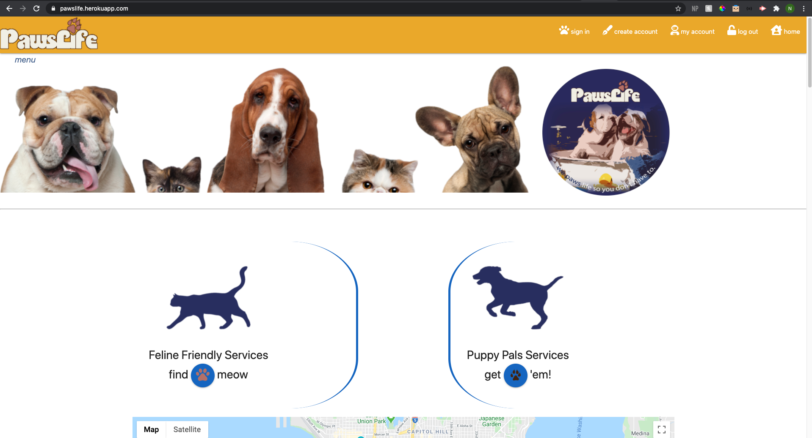

### Step 2

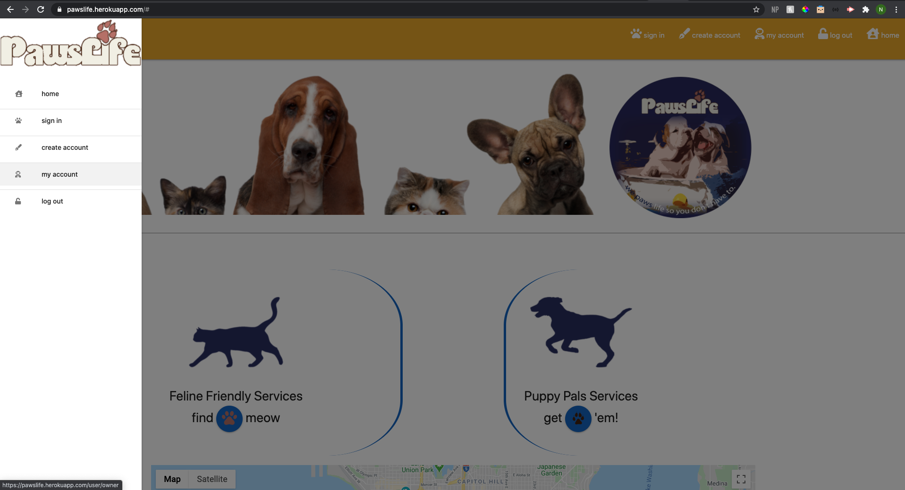

### Step 3

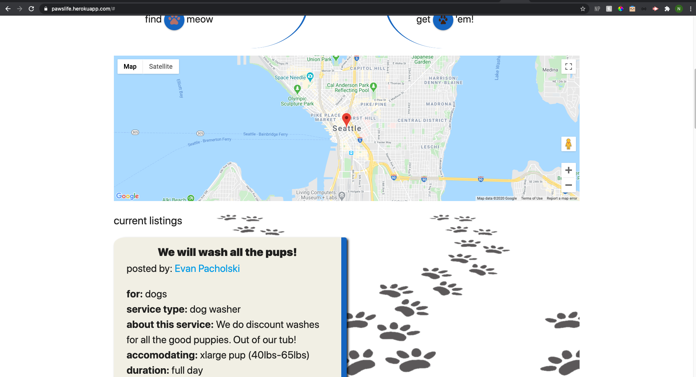

### Step 4

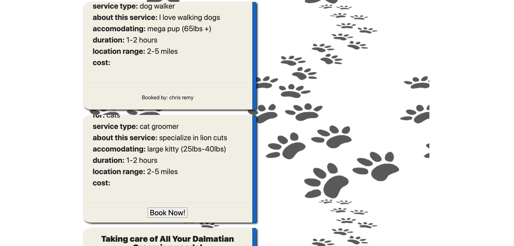

### Step 5

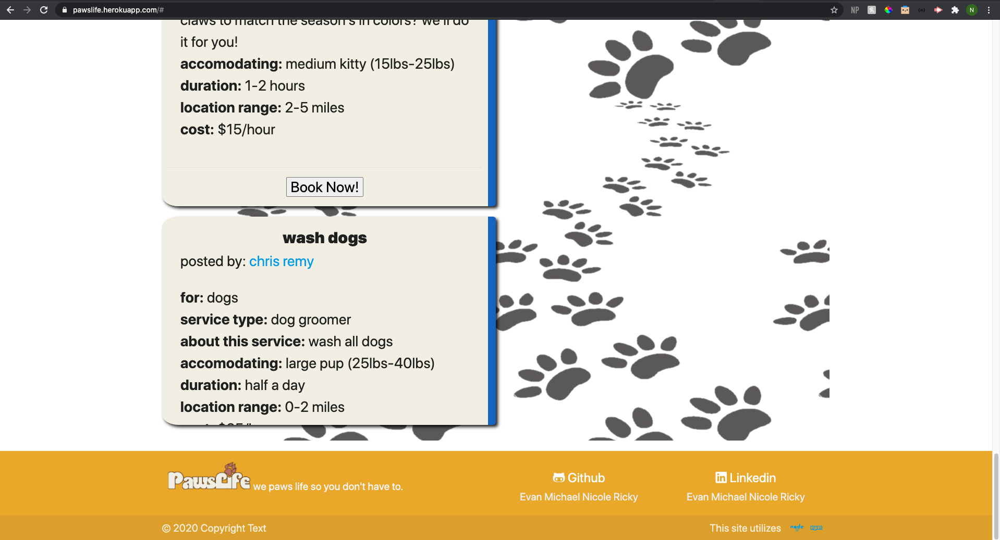

### Step 6

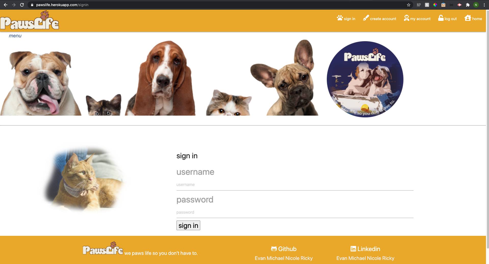

### Step 7

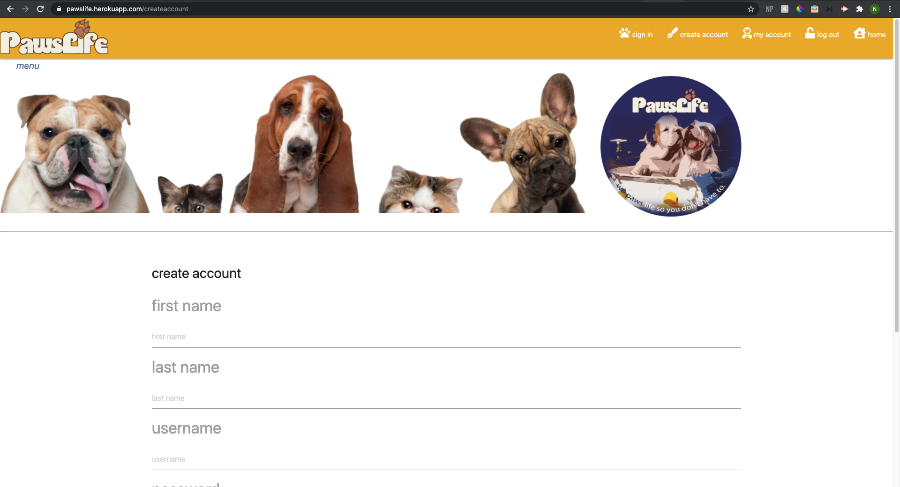

### Step 8

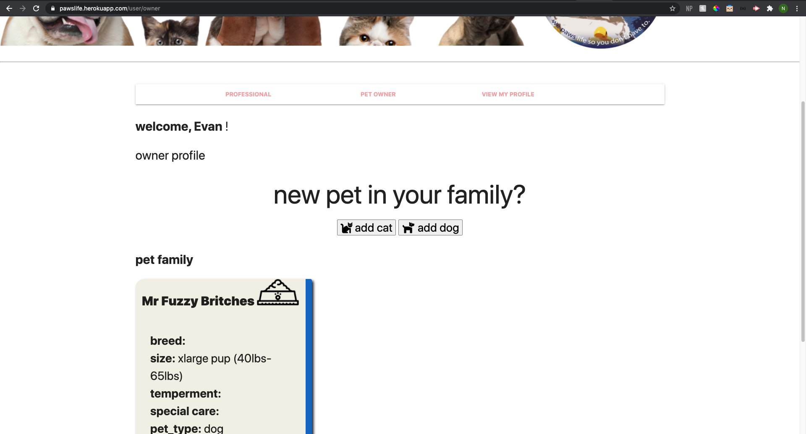

### Step 9

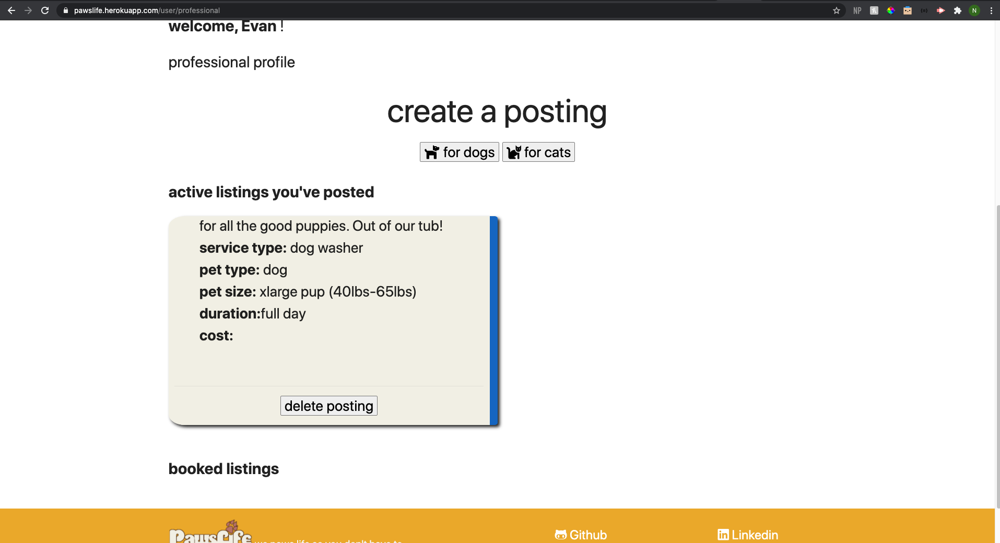

### Step 10

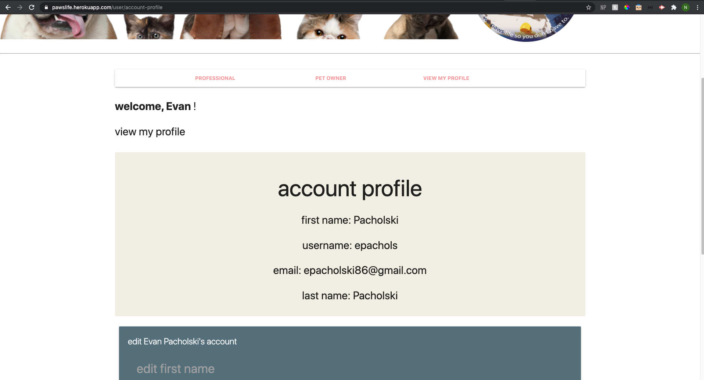

### Step 11

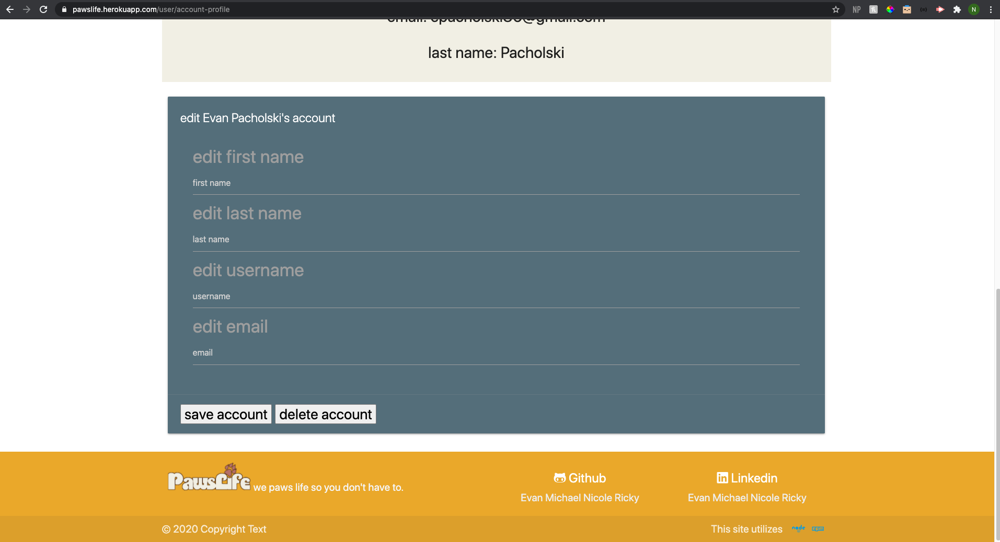

### Installation
In terminal, please make sure to npm init -y and npm i to import all dependencies. Please make sure to take the drop and create database information in order to create the database and tables in mysql.

### Usage
This application can be used to create pet service posts and keep track of all of your pets. 

### License 

This application is covered under MIT.

### Contributing 
Pull requests are welcome. For major changes, please open an issue first to discuss what you would like to change.

### Tests
Please make sure to update tests as appropriate.

### Questions
1. [Github](https://github.com/rickyg218/PawsLIfe-)

### Link to Deployed Application
1. [Pawslife](https://pawslife.herokuapp.com/)
    
     